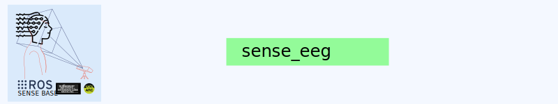

<div style="text-align: center;" align="center">
  
  <h1> sense_eeg </h1>
</div>

## :eyeglasses: Overview

`sense_eeg_cpp` is a ROS 2 (Humble) package that provides a C++ implementation of an EEG data acquisition node. The package publishes mock EEG data to ROS 2 topics using the custom EEGBlock message defined in eeg_msgs.

## How to Use

Clone the `sense-base/base` and create the directory `workspace/src`. Clone `sense_eeg_cpp` package into the `workspace/src`:


```bash
mkdir sense-base && cd sense-base
git clone git@github.com:sense-base/base.git
cd base
mkdir workspace/src
# Clone this sense_eeg_cpp repo
git clone git@github.com:sense-base/sense_eeg_cpp.git
# Clone the sense_msgs package
git clone git@github.com:sense-base/sense_msgs.git
```

Open the sense-base/base folder in VS Code and Reopen in Container when prompted. In the `.devcontainer`, build the workspace:

```bash
colcon build --packages-select eeg_msgs eeg_publisher_cpp
source install/setup.bash
ros2 launch eeg_publisher_cpp mock_publisher_launch.py
```

To modify the parameters, in the workspace run (for example):
```bash
ros2 run eeg_publisher_cpp mock_eeg_publisher --ros-args -p num_channels:=32 -p sampling_rate:=1024.0
```